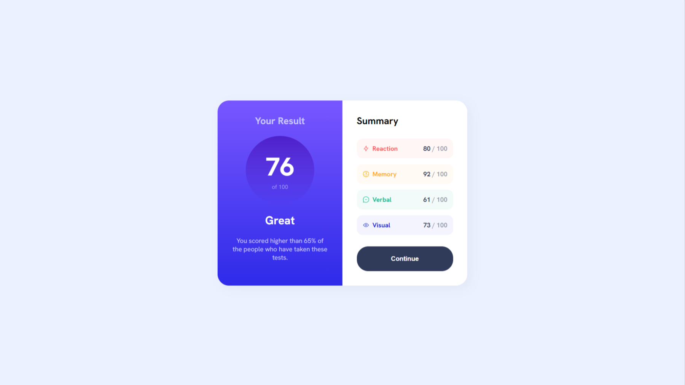
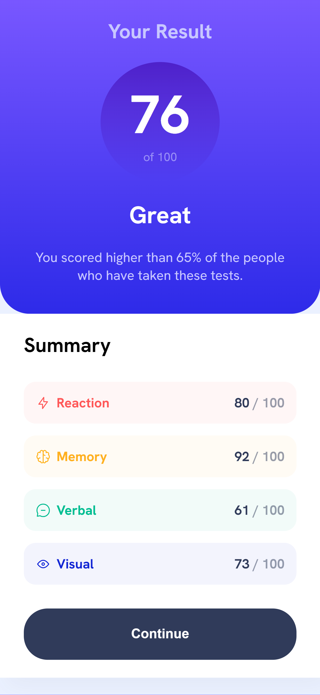

# 📊 Results Summary Component

Um componente de resumo de resultados focado em UI moderna, responsividade e fidelidade visual.

Desenvolvido com HTML e CSS puro, o projeto simula um dashboard de performance com métricas como Reaction, Memory, Verbal e Visual — um padrão comum em aplicações SaaS e produtos de análise de dados.

---

## 👁️ Preview

Visualização do projeto em diferentes dispositivos:

### 💻 Desktop



### 📱 Mobile



🔗 **Deploy:** https://alanborgesdev.github.io/results-summary  
📁 **Repositório:** https://github.com/alanborgesdev/results-summary

---

## 📝 Descrição

Este projeto consiste na implementação de um componente de interface inspirado em dashboards reais, com foco em:

* Clareza na visualização de dados
* Experiência do usuário (UX)
* Fidelidade ao design proposto
* Responsividade entre diferentes dispositivos

A solução destaca-se pelo uso de CSS moderno para criar layouts fluidos e consistentes.

---

## 🎯 Objetivo do Projeto

Aplicar boas práticas de desenvolvimento Front-End alinhadas ao mercado:

* 📱 **Mobile-First:** Desenvolvimento iniciado para dispositivos móveis
* 🎨 **Escalabilidade:** Uso de variáveis CSS para facilitar manutenção e evolução
* ♿ **Acessibilidade:** HTML semântico para melhor leitura e SEO
* 🎯 **Fidelidade Visual:** Precisão em espaçamentos, cores e gradientes

---

## 🛠 Tecnologias Utilizadas

* HTML5 (estrutura semântica)
* CSS3 (Flexbox, Gradientes e Responsividade)
* CSS Variables (Custom Properties)
* Metodologia Mobile-First
* Google Fonts (Hanken Grotesk)

---

## 🚀 Funcionalidades

* Layout totalmente responsivo (mobile → desktop)
* Exibição clara de métricas de performance
* Feedback visual com `hover` e `active`
* Uso de cores com `hsla` para profundidade visual
* Estrutura de estilos organizada e escalável

---

## ⚙️ Como Executar o Projeto

1. Clone o repositório:

```bash
git clone https://github.com/alanborgesdev/results-summary.git
```

2. Acesse a pasta:

```bash
cd results-summary
```

3. Abra o arquivo:

```bash
index.html
```

---

## 🧠 Aprendizados e Desafios

* 📐 **Flexbox na prática:** Controle de layout e alinhamento entre seções
* 🎯 **Precisão visual:** Uso de `aspect-ratio` e gradientes para construir elementos complexos
* 🧩 **Organização de código:** Separação entre `style.css` e `variables.css` para melhor manutenção

---

## 📄 Licença

Este projeto está sob a licença [MIT](./LICENSE).

---

## 👤 Autor

**Alan Borges**

* GitHub: https://github.com/alanborgesdev
* LinkedIn: https://www.linkedin.com/in/alanborgesdev/
* Portfólio: https://alanborgesdev.vercel.app/
